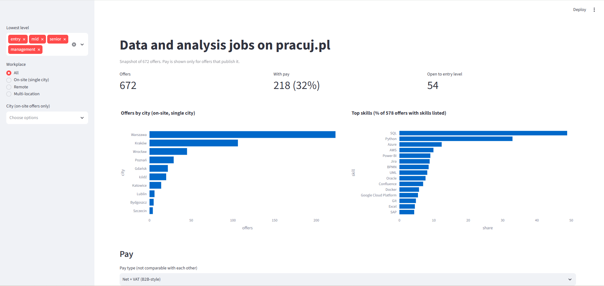
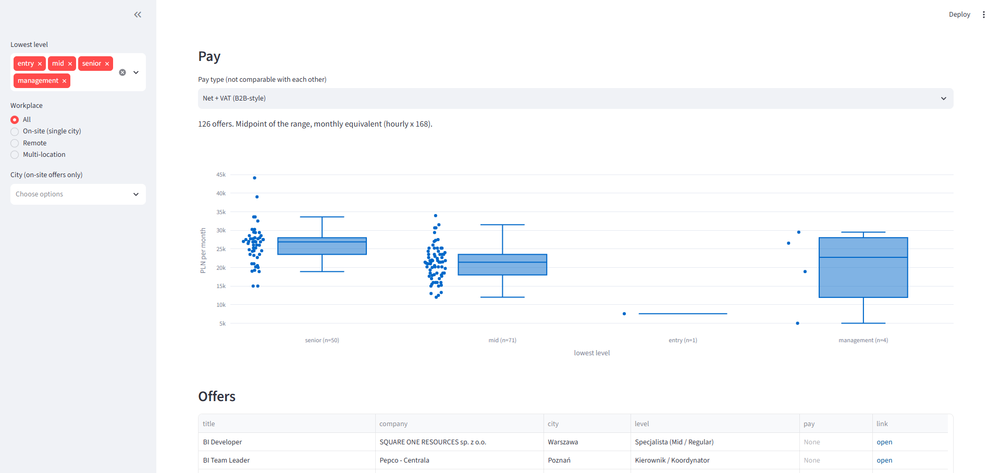
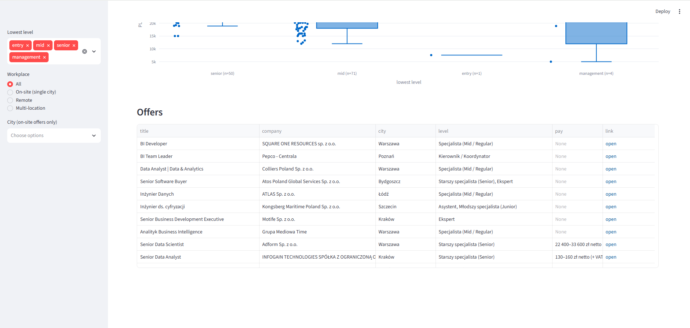

# Data and analysis jobs on pracuj.pl: a snapshot

**Question:** What do data and analysis job offers on pracuj.pl ask for, where are they, and what do they pay? The aim is to see what a junior candidate in Kraków is up against.





## Key findings
Based on 672 offers.

1. **Warsaw dominates and Kraków is second.** Of 508 on-site offers with a single city, 43.9% are in Warszawa (223) and 20.9% in Kraków (106), followed by Wrocław with 8.9%. A further 17.4% of all offers are remote, and 47 list several locations.
2. **Entry-level roles are scarce.** Only 8.0% of offers (54) have junior, intern or assistant as their lowest level, against 58.6% mid-level and 26.6% senior. Just 7 of the 54 are on-site in Kraków.
3. **SQL is the most requested skill.** It appears in 48.8% of offers that list skills (282 of 578), and in 25 of the 40 entry-level offers that list skills. Python appears in 32.9% of all offers.
4. **Employers publish pay more often for senior roles.** 32.4% of offers show pay: 20.4% of entry-level offers, 30.2% of mid-level and 43.0% of senior.
5. **Senior pay is higher than mid-level pay.** For offers quoted as net + VAT, the median monthly equivalent is about 26,900 PLN for senior (n=50, quartiles 23,500-28,000) against about 21,400 PLN for mid-level (n=71, quartiles 18,000-23,500), roughly 25% more.

## Data
- Source: pracuj.pl job offers, collected in the Kaggle dataset "DATASET NAME" by AUTHOR (LINK). License: LICENSE. Last updated: DATE.
- The dataset is filtered to data fields (data engineering, analysis, AI, ML). It also contains analyst-type roles, so these are "data and analysis related roles", not only data science.
- 672 offers, one snapshot. There is no date column, so the data can't show trends.

## Method
1. `scripts/01_inspect.py` inspects the raw file.
2. `scripts/02_clean.py` parses pay text, maps levels, splits locations and skills, and loads a SQLite database.
3. `scripts/03_analysis.py` computes the figures above. Raw output is in `results/analysis_output.txt`.
4. `app.py` is a Streamlit dashboard with filters for level, workplace and city.

Cleaning decisions:
- **Pay** is parsed from text. It is classified as gross (employment contract, "brutto"), net + VAT (B2B-style, "netto (+ VAT)") or depends on contract ("zal. od umowy"). The classification is inferred from the pay text, not an official contract label.
- **Hourly rates** are converted to monthly at 168 hours a month, which is an approximation.
- The **midpoint** of each pay range is used.
- Offers with several levels are labelled by their **lowest** level.
- The first part of `location` is the city. Remote offers and offers with several locations are kept out of the city counts.
- 3 offers with a monthly equivalent below 3,000 PLN were excluded. Two look like hourly rates labelled as monthly, and one is a very low gross offer.
- Skill names were merged (for example "Microsoft Power BI" and "Power BI").

## Limitations
- Only 218 of 672 offers (32.4%) publish pay, so pay results describe employers who disclose it and may not represent the market.
- Gross and net + VAT pay are not comparable. A net + VAT amount is before the contractor's own taxes and contributions.
- Samples are too small to compare pay between cities (Kraków has 7 net + VAT offers, Wrocław 4) or to report entry-level pay (11 offers with pay, split across pay types).
- These are offered salaries, not what people actually earn, and offers are not hires.
- One snapshot of one job board.

## How to run
```bash
python -m venv .venv
source .venv/Scripts/activate   # Windows Git Bash
pip install -r requirements.txt
# download jobs_pracujpl.csv from Kaggle into data/raw/ if it is not in the repo
python scripts/02_clean.py
python scripts/03_analysis.py
python -m streamlit run app.py
```

## Next steps
Collect offers repeatedly to track trends over time, add Eurostat or NBP data for context, and extend to more job boards.